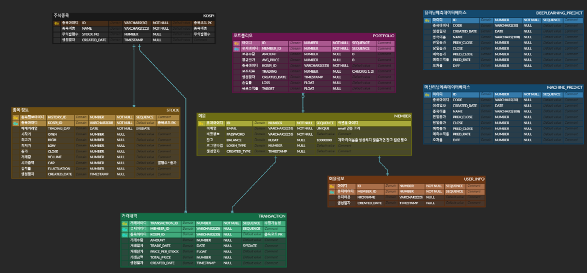
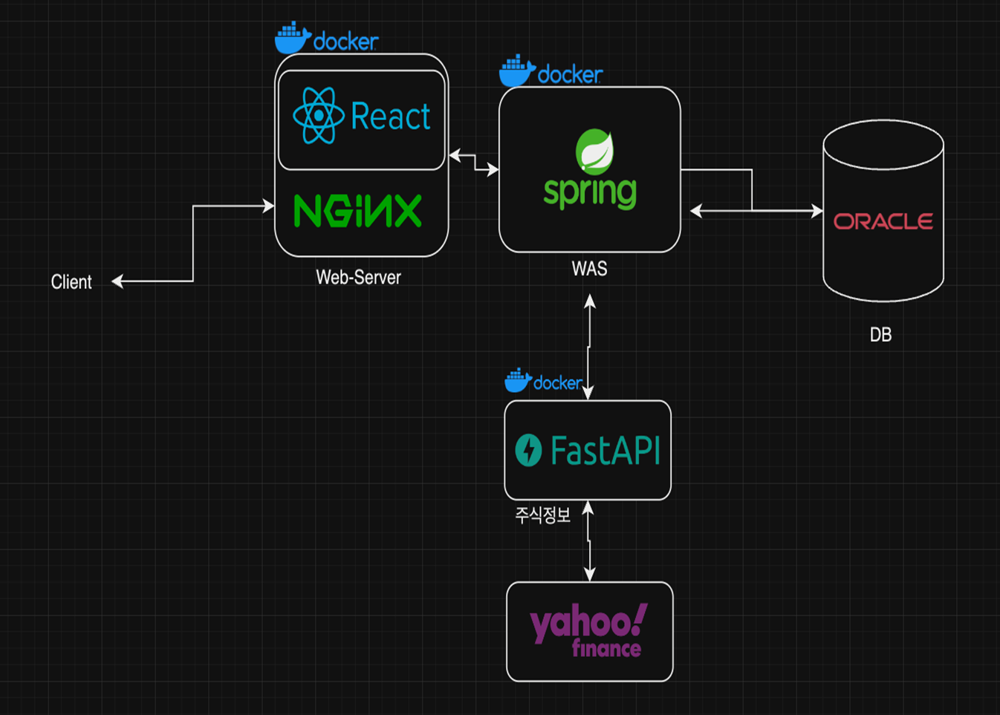
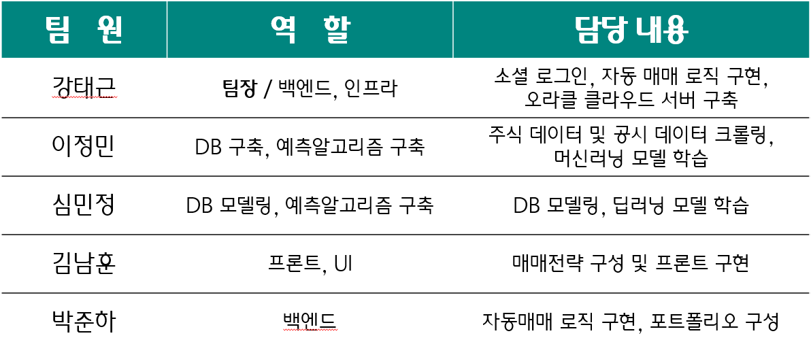

# 과목명 - AI 주식 자동매매

이 과목은 주식 자동 매매를 위한 AI 기반 웹 개발 프로젝트를 다루며, 주요 내용은 분석 및 예측을 위한 데이터베이스 구축, 분석 알고리즘 및 예측 알고리즘 개발, 자동 매매 주식 추천 기능 등을 구현하는 것입니다.

# 과목 개요

- 분석 및 예측 DB 구축
- 분석 알고리즘 개발
- 예측 알고리즘 개발
- 매매거래 주식 추천 기능 구현
- 웹 인터페이스 디자인 및 구현

# 과제 list

- 분석 및 예측 DB 구축
- 분석 알고리즘 및 예측 알고리즘 개발
- OPEN API(RESTful API)로 개발

### 과제 1 - 분석 및 예측 DB 구축

- 한국거래소, 네이버 금융 등에서 주식(코스피 전 종목)관련 자료를 최소 10년(2022년 기준) 이상 받아서 데이터 DB 구축함

### 과제 2 - 분석 알고리즘 및 예측 알고리즘 개발

- 예측 결과 비교 및 분석을 위해 1일전(당일 매매거래 예측 자료) Data 까지 분석 및 예측 DB에 추가함

### 과제 3 - OPEN API(RESTful API)로 개발

- FastAPI를 이용하여 주가 데이터와 예측 데이터를 업데이트 함

## ERD 다이어그램

 

## 시스템 아키텍처

 

## 발표 ppt

[발표자료]([https://www.notion.so/project.pptx](https://docs.google.com/presentation/d/1FoTpzd-xsLPuqLvlBeQwik3hS03Dmk7V/edit?usp=sharing&ouid=110145640305960539559&rtpof=true&sd=true)https://docs.google.com/presentation/d/1FoTpzd-xsLPuqLvlBeQwik3hS03Dmk7V/edit?usp=sharing&ouid=110145640305960539559&rtpof=true&sd=true) 

## 시연 동영상

 

## 느낀 점
팀 개발 프로젝트에서 협업과 소통의 중요성을 알게 되었습니다. 각자 개발하는 것은 각자의 생각에 순조롭다고 느꼈으나, 디테일한 부분에서 각자가 생각하는 부분이 다르게 생각할 수 있고, 개발한 기능을 합치는 과정에서 충돌을 수정하는 것이 시간이 많이 소요되었습니다. 약간은 번거롭더라도 대면 소통과 코드의 주석 등을 통해 생각하는 것을 정확히 전달하는 것이 굉장히 중요하다는 것을 배웠습니다. 서비스의 요구사항부터 개발, 산출물 작성까지 약소하게나마 전체의 과정을 모두 경험한 것이 앞으로의 개발 경험에 큰 도움이 될 것 같아서 각자가 개발한 것을 공유하고 피드백을 할 계획입니다.
